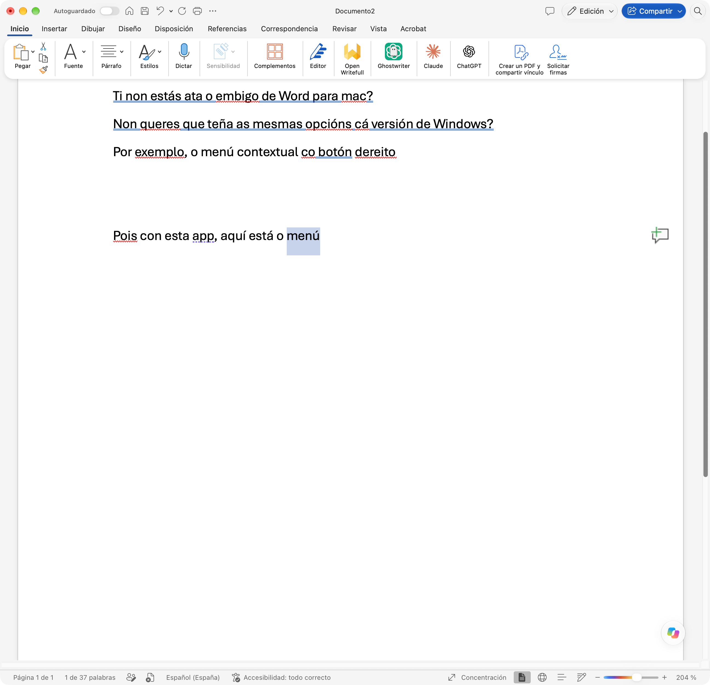

# MiniBarra para Word

Barra flotante de formato para Microsoft Word en macOS, como la de Word para la web:
aparece al seleccionar texto (arrastrando, con doble/triple clic o con mayúsculas + clic).

## Instalar (sin compilar nada)

1. Descarga **[MiniBarra-1.0.dmg](https://github.com/xabimr/MiniBarraWord/releases/latest/download/MiniBarra-1.0.dmg)**
   (Apple Silicon e Intel, macOS 14 o posterior).
2. Ábrelo y arrastra **MiniBarra** a **Aplicaciones**.
3. **Primera apertura:** la app no está firmada por un desarrollador de Apple, así que macOS
   la bloquea. Ábrela una vez, pulsa «Aceptar» en el aviso y ve a *Ajustes del Sistema →
   Privacidad y seguridad* → **Abrir igualmente**.
4. Concede los permisos (ver abajo). Aparecerá un icono «Aa» en la barra de menús.

Fuente · Tamaño · N K S · Color de fuente · Resaltado · Copiar formato · Viñetas/numeración ·
Estilos · Nuevo comentario · Borrar formato · ⋯ (Cortar, Copiar, Pegar solo texto, Fuente…, Párrafo…)

- Copiar formato: un clic lo aplica una vez; doble clic lo deja activo hasta pulsar Esc.
- El icono de la barra de menús permite desactivarla, abrirla al iniciar sesión, etc.

## Permisos
- **Automatización → Microsoft Word**: se pide la primera vez (aplicar formato vía AppleScript).
- **Accesibilidad**: para ocultar la barra al teclear, distinguir la cinta del documento
  y enviar atajos (comentario, cortar/copiar, diálogos Fuente/Párrafo).

La app se firma ad hoc: después de recompilar hay que volver a activar Accesibilidad
(Ajustes del Sistema → Privacidad y seguridad → Accesibilidad: quitar MiniBarra y añadirla).

## Compilar
    ./build.sh --install      # compila, firma e instala en ~/Applications
    .build/release/MiniBarra --check            # valida los AppleScript sin ejecutarlos
    .build/release/MiniBarra --preview /tmp/b   # captura de la barra (claro/oscuro)

---

> **Aviso:** esta app está hecha con [Claude](https://claude.ai) (Claude Code). Es un proyecto
> *vibe coding*: se ofrece tal cual, sin garantías, y no está afiliada a Microsoft ni a Anthropic.
